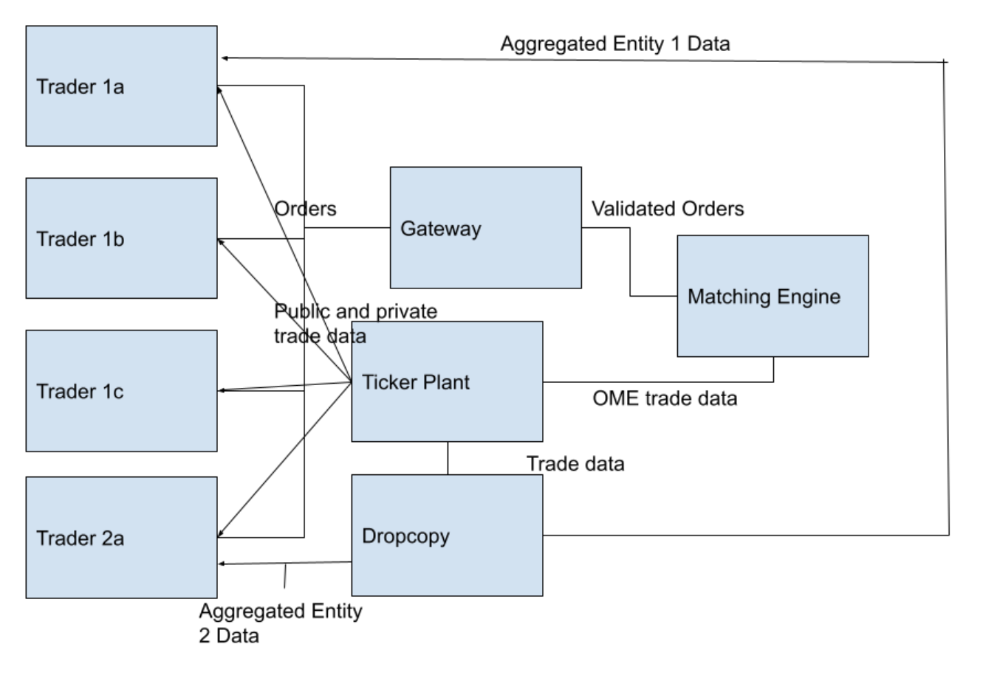

# Group 5 Final Project Proposal

## Project Overview 
We propose building an order book based exchange with a matching engine. We plan to also have a gateway, ticker plant, and dropcopy as core parts of our project. If time permits, we want to explore hosting this exchange on Solana.

This project would involve implementing a mini exchange. It would consist primarily of three applications: 1) a simple gateway where “customers” connect to directly, and then send orders to and receive updates from, 2) a simple matching engine which would receive the orders, determine if the order matches with any resting orders on the book, and then add that order to the order book), and 3) a simple market data ticker plant which would take the output messages sent by the matching engine, and generate an anonymized market data book update message.

In addition, we would also write a basic test app harnesses, which would make multiple connections to the gateway, send in multiple orders, and then validate that orders that should match do, orders that should rest in the order book do, and then that appropriate fill messages are received via the gateways, and that the correct market data updates are received from the ticker plant and dropcopy.

## Detailed Project Overview
### Mini Exchange Architecture Diagram

### Order Book/Matching Engine
- A basic data structure that stores trade id and bid/ask prices
- Supports add, remove, change operations
- Performs a trade when bid/ask prices are matched
- Sends a confirmation to the ticker plant when trades are successfully executed/canceled/changed
### Gateway
- Accepts trades from multiple fake traders and condenses the orders into a single continuous stream for consumption by the OME
- Basic order validation 
### Ticker Plant
- Displays current market data
- Data should be updated every “tick” OR event-driven from the OME
- Data should be available to everyone at the same time
- Will also send a copy to the dropcopy
###ESB
- Handle communication between all of the internal components of the system, so each only needs to burden itself with a single TCP connection
- Receive messages from each component and redirect them to the appropriate component
### Dropcopy
- Real time reports of what trades are being executed, aggregated by the entity who owns multiple trading clients
- Receives data from ticker plant, aggregates, and distributes out
- Essentially a log file with all of the trade information
### Trader
- Can submit basic trades
  - Market buy/sell
  - Limit order
- If time permits, will include additional trades of the following type
  - Stop loss order
  - Fill or Kill
  - Trades w/ expiration date

## Success Criteria
1. A trader is able to place buy and sell orders on an exchange
2. Trader receives information on current market prices
3. Out code is thoroughly tested

## Intended Technologies
- Rust Programming Language
- Solana (if time permits)

## Steps:
1. Create a detailed overview of our project
2. Finalize data protocol for input and output to each component
3. Implement each component in parallel
   1. OME
   2. Gateway
   3. Trader
   4. Ticker Plant
   5. Dropcopy
4. Combine components in a serial program
5. Write test harnesses
6. If time permits
   1. Port onto multiple VMs
   2. Port onto solana smart contracts

## Timeline
- 3/24 - Finish scoping document and begin development
- 3/31 - Rust Training, setup CI/CD
- 4/7 - Develop core components in parallel
- 4/14 - Development and write test harnesses
- 4/21 - Combine into serial program
- 4/28 - Thorough additional testing and, if time permits, VM porting
- 5/5 - If time permits, exploration of blockchain hosting
- 5/12 - Final review and complete project 

## Initial Work Assignment
- Akhil - Develop and test order book & matching engine, integration & system tests, Vagrant VM setup
- Akul - Develop and test order book & matching engine, integration & system tests
- Aman - Trader (Client), Gateway
- Nisha - Ticker Plant, Dropcopy

## Final Work Assignment
- Akhil - order book & matching engine, Vagrant VM setup, CI/CD setup, integration & system tests,
- Akul - Dropcopy, UDP, integration & system tests
- Aman - Trader (Client), Ticker Plant, integration & system tests
- Nisha - Gateway, TCP, UDP, integration & system tests

## Member System Specs
| Name  |                     OS                     |  RAM  |            Processor             |
|:-----:|:------------------------------------------:|:-----:|:--------------------------------:|
| Akhil |      macOS Monterey Version 12.3       | 16 GB |   Intel Core i7 6-Core 2.6 GHz   |
| Akul  |                 Windows 11                 | 16 GB |   Intel(R) Core(TM) i7-1065G7    |
| Aman  | Windows 10 Home  OS build: 19044.1586  | 16 GB |    Intel(R) Core(TM) i7-8565U    |
| Nisha |      macOS Monterey Version 12.3       | 16 GB | Intel Core i7 Quad-Core 2.8 GHz  |

